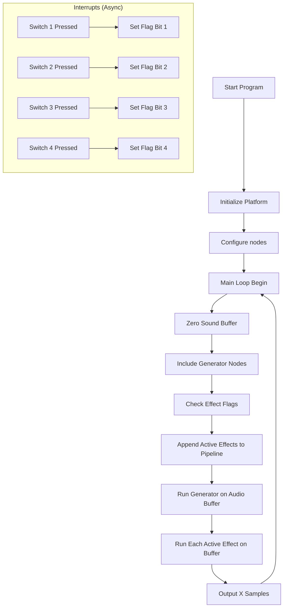
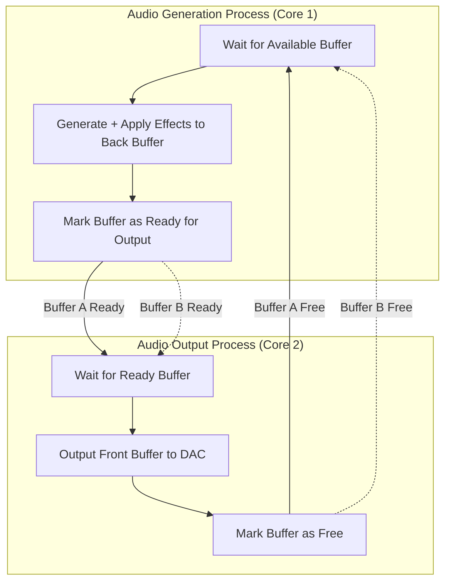

# Audio Synthesizer Project

This project was developed as part of the "Audio Processing" class at PXL University of Applied Sciences and Arts, commissioned by Vincent Claes. The goal is to design and implement a functional audio synthesizer capable of generating and manipulating sound in real time on an embedded FPGA development board, the PYNQ Z2.

The synthesizer is built using a simple linear modular architecture and supports basic waveform generation, volume gating, and digital effects. The final implementation runs on the embedded ARM cortex A9 CPU and works with a custom hardware platform that lives in the chip's programmable logic.

## Scoring matrix

To make it a bit easier for our lecturer, we already provide you with a filled in list of the scoring matrix so you have an easier time scoring us :)

```
+--------------------+--------+-------------+-----------+------+------------+
| Matrix             | Slecht | Onvoldoende | Voldoende | Goed | Uitstekend |
+--------------------+--------+-------------+-----------+------+------------+
| Functionaliteit    |        |             |           |      | 10         |
+--------------------+--------+-------------+-----------+------+------------+
| Creativiteit       |        |             |           | 7    |            |
+--------------------+--------+-------------+-----------+------+------------+
| Outputkwaliteit    |        |             | 3         | 4    |            |
+--------------------+--------+-------------+-----------+------+------------+
| Inputmogelijkheden |        |             |           | 4    |            |
+--------------------+--------+-------------+-----------+------+------------+
| Documentatie       |        |             |           |      | 4          |
+--------------------+--------+-------------+-----------+------+------------+
```

This should result in a 28/35 or 29/35 depending on how detrimental the high pitch noise is regarded as. Even though we do propose a solution, the solution we currently have is out of scope to create an implementation.

Additionally, if custom hardware-ip blocks for user IO counts as 'Creativiteit en innovatie in soundeffecten' this could also result in the 7 being converted to a 10. Which would result in either a 31/35 or 32/35

---

## Table of Contents

- [Features](#features)
- [Architecture](#architecture)
- [Project Structure](#project-structure)
- [Changing the pipeline](#changing-the-pipeline)
- [Build Instructions](#build-instructions)
- [Run Instructions](#run-instructions)
- [Known Issues](#known-issues)

---

## Features

- A linear multi-purpose processing pipeline

- User input through on board buttons and external keypad

- Useful library functions to simplify audio

- Functions to process notes from a equal temperament scale to frequencies

- Built in functions for
  
  - Generating sines
  
  - Generating saws
  
  - Generating squares
  
  - Generating triangles
  
  - Generating supersines
  
  - Generating supersaws
  
  - Generating superstriangles
  
  - Distortion
  
  - Low pass filtering
  
  - Rhythmic gating
  
  - Sample delays

## Architecture

The synthesizer is built on a linear pipeline principle where a buffer of x amount of samples is made. Each generator and effect are then put into a list. This list is sequentially executed where each function of the node performs their intended behavior on the buffer to finally be sent of to be outputted.

This buffer is a global variable and together with some other important global definitions it provides the core way of working in the pipeline

**Macros**

`MAINBUFFER_SIZE` Denotes the size of the global audio buffer
`BUFFER_TIME_MS` Denotes the amount of time it should take to output one full audio buffer
`SAMPLE_INTERVAL_US` Calculated based on the `MAINBUFFER_SIZE` and `BUFFER_TIME_MS` it denotes the amount of milliseconds between each sample, it is used for the output function to precisely time the output rate.
`SAMPLE_RATE_HZ` Calculated based on the `MAINBUFFER_SIZE` and `BUFFER_TIME_MS` it denotes the sample rate of the project. It declares how many times per second a piece of information has to be transmitted. It is also used  by some effects.

**Global variables**

`g_sample_index` This variable should be incremented every time one cycle through the pipeline finishes. It is used for some effects to know how much time has elapsed since startup independent of system time. 
`g_sound_buffer[MAINBUFFER_SIZE]` This is the main sound buffer that hold X amount of samples. Each generator and effect should only manipulate data in this buffer
`g_keys_pressed[7]` This is used by the generators to determine what pitches to play. There is no convention as to what number corresponds to what note, this standard still has to be defined

Another key concept is the node based approach. In order to dynamically take away and add new effects to the chain the function has to be padded around a standard wrapper. This wrapper contains the configuration for the node and a pointer to the function. The function itself it responsible for correctly interpreting the config pointer it gets and the developer is responsible for actually providing a pointer to both the function and the configuration. Using these nodes the effect pipeline sequentially goes through each node and calls their function with the corresponding config

```c
struct generic_pipeline_node{
    void* config;
    void (*fnptr)(void*);
};
```

The config can be any made struct, an example could be, the pointer to this struct should be casted to a `void*`

```c
struct sine_generator_config{
    float freq;
    uint32_t amp;
    OscState phasebuffer;
};
```



This approach leaves space to dynamically modify settings of the effects in the pipeline.  Via interrupts and user should be able to change parameters of each effect using physical buttons and immediately hear changes.

## Project Structure

The main folder structure is as follows

```
├───AudioProcessing2
├───RemoteSystemsTempFiles
├───synthesiser
│   ├───src
│   │   ├───ComputeLibrary
│   │   ├───dsp
│   │   ├───effects
│   │   ├───Include
│   │   ├───oscilators
│   │   ├───PrivateInclude
│   │   └───Source
│   └───_ide
└───synthesiser_system
```

`AudioProcessing2` This is the hardware platform, unless you know what you are doing it is recommended to not mess around here

`RemoteSystemsTempFiles` Vitis project information

`synthesiser_system` Vitis project information

`synthesiser` Contains the software project with `src/helloworld.c` containing the main function. Other files in the `src` directory relate to either external libraries like CMSIS-DSP or custom make libraries like `synth_lib`

`synthesiser/src/effects` This folder is used to contain functions used for applying effects. Each effect has its own separate C file and is declared in the common `sound_effects.h` file

`synthesiser/src/oscilators` This folder is used to contain functions used for generating sounds. Each effect has its own separate C file and is declared in the common `generators.h` file

## Changing the pipeline

While the pipeline is defined in the helloworld.c file and can be edited by any text editor. It is strongly recommended to make use of the [Vitis ide](https://www.amd.com/en/products/software/adaptive-socs-and-fpgas/vitis.html) for development as it includes important tools to make your program run on the Pynq board.

You can change or add generators by changing

```c
//Synth pipeline
struct generic_pipeline_node pipeline[5] ;  //Register the nodes here
```

By default it expect 1 generator and 4 effects but this can be changed to you liking.

For each effect or generator it is import to define a node and optionally a config struct right above it. You can reference the currently present nodes to get an idea of how to do it.

If you want to add multiple generators increase the pipeline size and add it right below the pipeline

```c
 //Synth pipeline
 struct generic_pipeline_node pipeline[5] ;  //Register the nodes here
 pipeline[0]    =    osc1_node;
 pipeline[1]    =    osc2_node;
```

If you want static effects what aren't controlled by the buttons you can also add effects in the same way.

If you do want to control these effects using the buttons on the board you have to register the effects(or generators) inside the while loop. You can interchange the nodes in this section of the code. In case you have added more fixed generators/effects make sure to change `int idx` accordingly

```c
//Build pipeline for this buffer: oscillator + any active effects
int idx = 1;
if (active_fx & 0x1) pipeline[idx++] = distortion_node;
if (active_fx & 0x2) pipeline[idx++] = delay_node;
if (active_fx & 0x4) pipeline[idx++] = gating_node;
if (active_fx & 0x8) pipeline[idx++] = fx_lp_node;
int pipeline_size = idx;
```

## Build Instructions

*TODO: Step-by-step guide to build the synthesizer, including toolchain setup.*

## Run Instructions

*TODO: How to load the project, configure it, and run the synthesizer.*

## Known Issues

**High pitch noise due to delay while generating**

In the current pipeline configuration there is a high pitches noise that is happening roughly every 1.8ms with a buffer output time of 2ms. This is likely because during this time the pipeline is executing and the program has to halt until new data is available. In audio this causes a notable disturbance. 

*TODO: ADD IMAGE OF THE PHENOMENON*

In the current setup this will have to be solved using parallelism. Using both cores available to split the generation and the output mechanisms to eliminate this high pitch noise. Sadly this issue was not able to be fixed due to the high complexity involved with dual-core systems and our limited knowledge about the topic. In case it does get integrated a approach like follows can be used.


